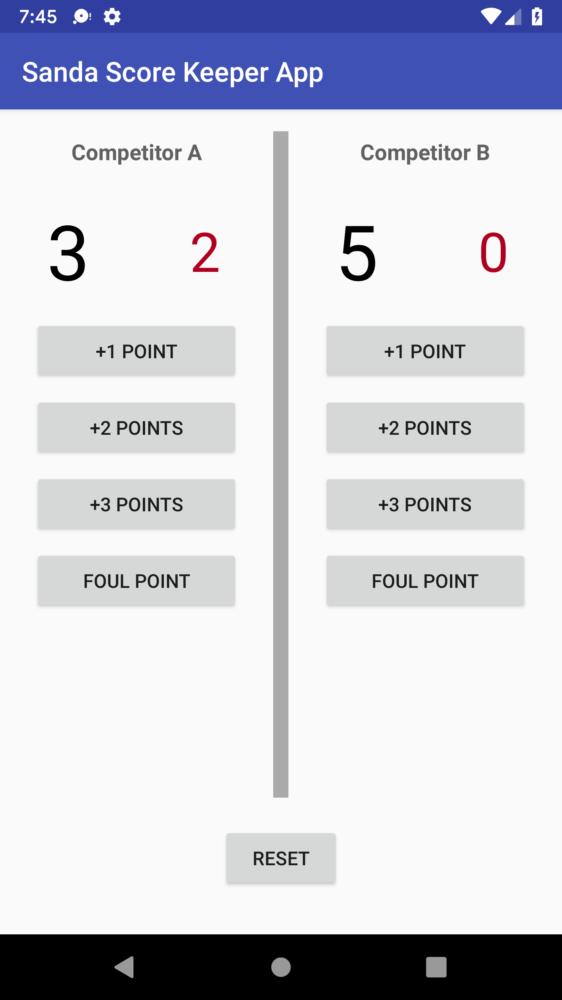

# Udacity Android Basics Nanodegree - SandaScoreKeeperApp
This repository contains the SandaScoreKeeperApp app from Udacity's User Input course. This app is created using Android 
Studio. The layout was designed in an XML document using a combination of a RelativeLayout, LinearLayouts, Textviews, Buttons, and Views.
The app was developed in Java.

## Overview
SandaScoreKeeperApp is a score keeping app that allows the user to add points and fouls to a competitor's score and see the updated score.
The app also allows the user to reset the scores of both competitors simulataneously.

